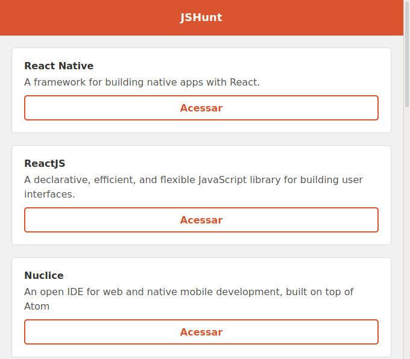
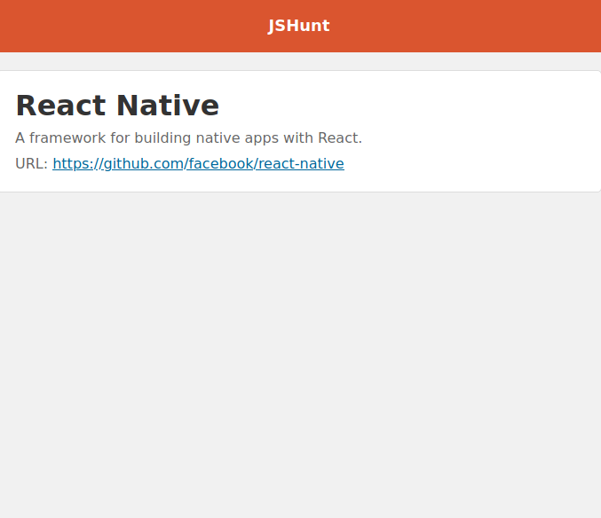

# **Apresentação**:

## ***JSHunt***

 
 

 
 

---

## :book: **Sobre:**

Creiei este pequeno projeto nas aulas da [rocketseat](rocketseat.com.br). Durante o projeto aprendi alguns conceitos simples, porém importantes de **ReactJS**.

Entre eles:
* Uso de estado;
* Requisição à API;
* Async/Await;
* Componentização;
* Criação e gerenciamento de Rotas;
* Paginação.

 

---

## :computer: **Técnologias:**

* React;
* Create-react-app;
* React-router-dom;
* Yarn;
* Axios;